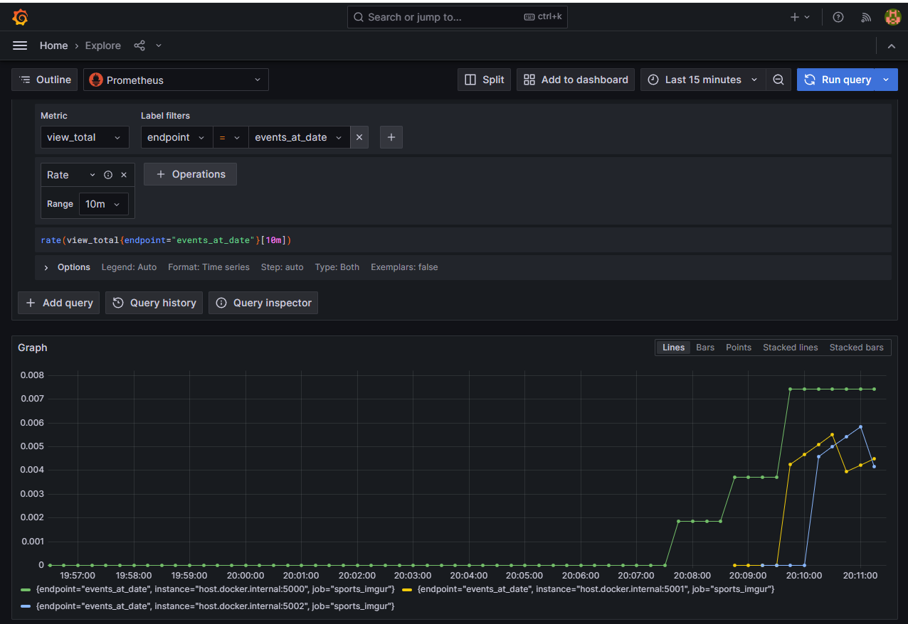

# PAD Reexamination Task
### Răzvan Fișer, FAF-203
_______
## How to Run this Project
1. Pull the images from this page: https://hub.docker.com/repositories/razvanfiser;
2. Clone this repository and run `docker-compose up -d` from within it;
3. Wait a couple of minutes until all containers are STARTED;

## How to Test This Project

* ### Separated Database for each service:
    * **Imgur Service**: First, run the `Search for Image on Imgur` request from either the `Api-Gateway` folder or the 
  Run the `Imgur Service` folder. Now the database should be populated with all the links that were 
  present in all of the request responses from this endpoint. Run the `Get Database` 
  command from the `Imgur Service` folder, which should finally return you the list of all the links, which means the database runs smoothly;
    * **SportScore Service**: Simply run the `Name of Sport by ID` request from the `SportScore Service` folder. This endpoint sends a request to the database which will return the sport defined by
  its respective ID. (e.g. 1= "football");

* ### Status Endpoint:
    Every folder in the Postman collection contains a Status request, which displays the
    status for every service, along with its database and upstream service. **Api-Gateway**
    Status is the aggregated statuses from the other microservices;
* ###  Task Timeouts for all Requests
    Run the `Sports Service Timeout` and `Imgur Service Timeout` requests from the `Api-gateway` folder in Postman. You 
should get a "Request Timeout" message and a <b>408 Request Timeout</b> header
in response after **5 seconds**. The underlying mechanism behind this should work the same
for any other endpoint if it takes more time than usual for some reason;

* ### Concurrent tasks limit:
    If you are on Windows, simply run the following command:
`for i in {1..10}; do curl -s http://localhost:8080/players/1 & done`. This will send
a bunch of simultaneous curl requests to this specific endpoint and you should see that not all
of them are served. You can also check the **Docker Logs** on the **api-gateway** container for more info.

* ### Business Logic and Aggregated Endpoints
    You can check the Postman collection for details on what each endpoint does, but most of them are
pretty self-explainatory. The aggregated endpoints from both services are:
  * `Aggreg Teams by Sport`: This will show info on different teams based on the sport ID in the request
  path and also show links to relevant images based on the sport;
  * `Aggreg Live Events`: This will show info on different live events on the sport ID in the request
  path and also show links to relevant images based on the sport;
  * `Aggreg Players by Sport`: This will show info on different players based on the sport ID in the request
  path and also show links to relevant images based on the sport;

**Notice: Sometimes there is a bug where the links to Imgur don't appear in the Postman request response,
so please use Mozilla Firefox or Google Chrome for these endpoints.**

* ### Redis Cache for Gateway:
    The responses from the `Search for Image on Imgur` from the `Api-Gateway` folder are
    recorded inside the Redis Cache. You should send the same request twice and check the logs inside the
    `api-gateway` Docker Container for confirmation. You should see "Redis Cahce hit for key: {your query string here}"
    if it works and you should probably notice that the request is served much quicker;
* ### Load Balancing:
    Send a bunch of requests to the same service and check the Docker Container logs. You should see
    that the replicas receive the requests one-by-one, in a cyclical manner. 
* ### Prometheus + Grafana
  1. Send a bunch of requests to any of the services;
  2. Type `localhost:3000` in your browser and loging with credentials admin/admin;
  3. Press "skip" when prompted to change credentials;
  4. Press the menu button on the top-left and then press "Explore";
  5. You can run queries on the "view_total" metric (don't forget to add the "Rate" operation);
  6. I recommend running the following query: `rate(view_total{endpoint="events_at_date"}[5m])` and 
  running the `Events by Date` request a couple of times and refresh in order to see results;
  7. You should see something like this after a couple of requests and waiting for some time:
  